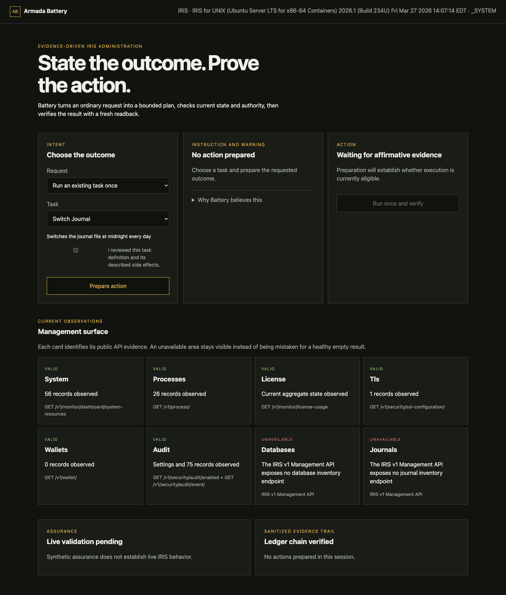
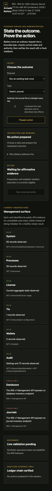

# Armada Battery

<p align="center"></p>

Armada Battery is an evidence-driven management portal for InterSystems IRIS.
It accepts an intended administrative outcome, proves the prerequisites of the
safest applicable action, executes within declared bounds, and verifies the
result from a fresh observation.

The working slice covers four ordinary requests: run an existing task, schedule
an existing task, create a bounded REST application, and grant an existing
reviewed role to an existing user. It runs against a bundled synthetic adapter
by default and can connect to the public IRIS SysAdmin API using server-side
environment variables.

Every flow separates preparation from execution. Preparation compares the
request with current state, authority, and rule maturity. Execution uses a
short-lived single-use certificate, records the attempt before transport, and
requires fresh readback before reporting verified success.

The management surface also collects bounded, read-only observations for
system resources, processes, databases, license usage, audit configuration,
journals, TLS configuration metadata, and wallet collection metadata. A denied
area stays visible as `FORBIDDEN`; it is never presented as an empty healthy
result.

## Screenshots




Captured from the live read-only deployment connected to InterSystems IRIS
Community Edition 2026.1. The verifier observed an authenticated IRIS session,
16 scheduled tasks, six valid management areas, explicit unavailability for
database and journal inventory, and `changes_enabled: false`.

## Run the synthetic demonstration

```bash
python3 -m pip install -r requirements.txt
python3 -m uvicorn app:app --host 127.0.0.1 --port 8080
```

Open `http://127.0.0.1:8080`. No credentials or external services are required.

## Run Battery with IRIS Community Edition

An OCI runtime such as Docker or Podman is required. Copy `.env.example` to
`.env`, replace the sample password, and start the stack:

```bash
git clone https://github.com/rbnbric/armada-battery.git
cd armada-battery
cp .env.example .env
# Set IRIS_PASSWORD in .env to a long local demo password.
docker compose up --build -d
python3 scripts/verify_container.py
```

The first `docker compose up --build -d` initializes a fresh IRIS instance:
`iris-init` prepares the durable storage and writes the password file, then IRIS
starts and applies `IRIS_PASSWORD` to `_SYSTEM`. Initialization can take a
couple of minutes; run `python3 scripts/verify_container.py` after it completes
(the script itself waits and retries for up to three minutes). No host
preparation, `chown`, or manual first-login password change is required.

Battery is available at `http://127.0.0.1:8080`; the IRIS Management Portal is
available at `http://127.0.0.1:52773/csp/sys/UtilHome.csp`.

The composed application binds its published ports to localhost and starts in
read-only mode with its live rules at
`DRAFT`. It may inspect the actual IRIS instance, but it will not mutate IRIS
until the live workflow has been observed, its test evidence recorded, and the
rule configuration deliberately promoted. Stop the stack with:

```bash
docker compose down
```

Named volumes preserve IRIS and Battery state (IRIS durable instance data lives
on the `iris-data` volume mounted at `/durable`). `docker compose down -v`
deletes those volumes and is intentionally not part of the normal instructions;
a later `docker compose up` would then initialize a fresh IRIS instance again.

## Run the tests

```bash
python3 -m unittest discover -s tests -v
```

Run the short judging demonstration separately:

```bash
python3 scripts/run_scenarios.py
```

It proves eight named behaviors, including restraint after a failed task,
expiration of stale authorization, idempotency, concurrent-change rejection,
and reconciliation after an ambiguous transport result without a retry.

## Contest

Armada Battery is an entry in the
[InterSystems Programming Contest — Build Your Own Management Portal](https://community.intersystems.com/post/intersystems-programming-contest-build-your-own-management-portal).
The contest listing is
<https://openexchange.intersystems.com/contest/48>.

Judges can start with the synthetic demonstration and
`python3 scripts/run_scenarios.py` for the eight deterministic behaviors, then
run the composed stack to see the same observe-to-verify loop against a live
IRIS Community Edition instance.

## Connect to IRIS

Set `BATTERY_IRIS_URL` to the SysAdmin API root ending in `/api/admin`. Supply
either `BATTERY_IRIS_BEARER` or both `BATTERY_IRIS_USER` and
`BATTERY_IRIS_PASSWORD`. Credentials remain in the server process and are never
sent to the browser.

Live state changes also require `BATTERY_ALLOW_CHANGES=true`. Until a rule has
recorded live validation, Battery permits inspection and preflight but blocks
execution. Set `BATTERY_RULE_VALIDATION` only after recording the corresponding
live evidence; supported values are `DRAFT`, `SIMULATED`, `LIVE_OBSERVED`, and
`APPROVED`.

The product contract is in [PRODUCT_SPEC.md](PRODUCT_SPEC.md), and coverage is
tracked in [WORKFLOW_MATRIX.md](WORKFLOW_MATRIX.md).
