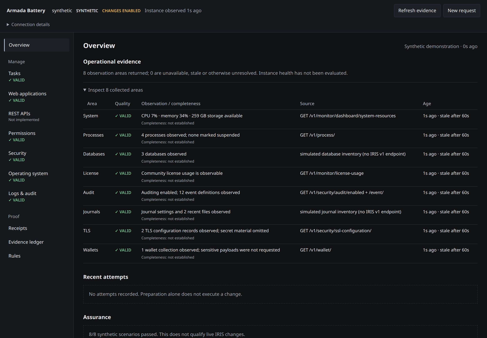
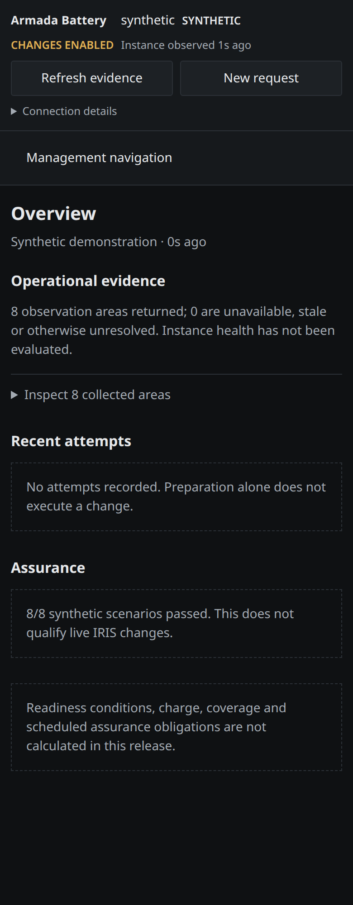

# Armada Battery

<p align="center"></p>

Armada Battery is an adversarially tested change-control engine for four
consequential InterSystems IRIS administration workflows. It is built around the
failure cases ordinary admin screens tend to hide: stale review state, replay,
concurrent change, ambiguous dispatch, restart, and incomplete verification.

Each request is bound to a short-lived, single-use authorization certificate.
Battery records the attempt durably before dispatch, verifies the resulting state
with fresh evidence, and never turns an uncertain transport outcome into permission
to resend the change. Unresolved outcomes stay visible until reconciliation.

**[Open the credential-free walkthrough](https://rbnbric.github.io/armada-battery/)**
— a clearly labeled synthetic judge path that sends no request to IRIS.

## What the demonstration proves

The concrete failure case is a task request whose transport response disappears.
Battery records one dispatch, reports the outcome as unknown, and refuses to send
the mutation again. When fresh correlated history arrives, it reconciles that same
attempt to `VERIFIED_SUCCESS`.

| Measured result | Outcome |
|---|---:|
| Adapter dispatches | **1** |
| Automatic retries | **0** |
| Deterministic failure-mode checks | **8/8 passed** |
| Final state after fresh evidence | **VERIFIED_SUCCESS** |

The checks also cover insufficient privilege, a previous failed task, stale
authorization, an unqualified rule, concurrent target changes, intentional
changes, and secret-free evidence. This is synthetic qualification of the engine;
it does not claim that a live IRIS mutation has been qualified.

The working slice covers four ordinary requests: run an existing task, schedule
an existing task, create a bounded REST application, and grant an existing
reviewed role to an existing user. It runs against a bundled synthetic adapter
by default and can connect to the public IRIS SysAdmin API using server-side
environment variables.

The console separates instance authority from adapter context, shows observation
freshness, and keeps unsupported management areas visible. New requests have an
explicit prepare → authorize → execute → verify lifecycle. Receipts expose their
actual before/after observations and related ledger records.

Every flow separates preparation from execution. Preparation compares the
request with current state, authority, and rule maturity. Execution uses a
short-lived single-use certificate, records the attempt before transport, and
requires fresh readback before reporting verified success.

## Judge fast path

No IRIS instance is required for the deterministic evaluation path. Open the
[hosted synthetic walkthrough](https://rbnbric.github.io/armada-battery/), select
**Try the one-dispatch proof**, review the demonstration task, prepare it, and
choose **Run and verify**. The resulting receipt shows the original ambiguous
dispatch reconciled without resend.

No installation, account, credentials, IRIS download, or local Python is required.
The same proof can run entirely inside Docker:

```bash
git clone https://github.com/rbnbric/armada-battery.git
cd armada-battery
docker compose up -d
docker compose run --rm proof
```

Open `http://127.0.0.1:8080`. The default Compose path starts only the lightweight
synthetic application; it does not download or wait for an IRIS image.

The complete local gate is 46 backend tests, four UI lifecycle tests, and all
eight scenario demonstrations. The optional Compose overlay below adds a real IRIS
Community Edition instance and starts conservatively with changes disabled.

The management surface also collects bounded, read-only observations for
system resources, processes, databases, license usage, audit configuration,
journals, TLS configuration metadata, and wallet collection metadata. A denied
area stays visible as `FORBIDDEN`; it is never presented as an empty healthy
result.

## Screenshots




These show the bundled **synthetic adapter**, rendered at 1440px and 390px.
Synthetic values are demonstration fixtures, not measurements of an IRIS instance.

## Current qualification and limits

The four workflows are covered by synthetic tests. Live task definition and runtime
information use separate API reads. The IRIS v1 run response supplies no attempt
correlation identifier, so a new history row alone cannot qualify a live run as
`VERIFIED_SUCCESS`. Live task runs remain unverified when attribution is unavailable.
Configuration receipts establish configuration readback only, not service behavior.

The default Compose stack remains observation-only with `DRAFT` rules. The container
verifier checks connection, collection and an **unreviewed, blocked** task preflight;
it does not prove live mutations. Readiness/charge/coverage calculations, subsystem
log search, REST exploration, and security-object changes are not implemented.

See [implementation and qualification notes](docs/IMPLEMENTATION_STATUS.md) for the
P0/P1 design reconciliation and remaining work.

## Run the synthetic demonstration with local Python

```bash
python3 -m pip install -r requirements.txt
python3 -m uvicorn app:app --host 127.0.0.1 --port 8080 --no-access-log
```

Open `http://127.0.0.1:8080`. No credentials or external services are required.

## Run Battery with IRIS Community Edition

An OCI runtime such as Docker or Podman is required. This path downloads the
larger InterSystems image and therefore takes longer than the synthetic judge
path. Copy `.env.example` to `.env`, replace the sample password, and start the
IRIS overlay:

```bash
git clone https://github.com/rbnbric/armada-battery.git
cd armada-battery
cp .env.example .env
# Set IRIS_PASSWORD in .env to a long local demo password.
docker compose -f compose.yaml -f compose.iris.yaml up -d
docker compose -f compose.yaml -f compose.iris.yaml exec battery \
  python scripts/verify_container.py
```

The overlay defaults to the InterSystems IRIS Community Edition `latest-cd`
image (2026.2 at the time of this revision), replacing the older 2026.1
extended-maintenance demonstration image. Set `IRIS_IMAGE` to reproduce a
specific release.

The first full-stack start initializes a fresh IRIS instance:
`iris-init` prepares the durable storage and writes the password file, then IRIS
starts and applies `IRIS_PASSWORD` to `_SYSTEM`. Initialization can take a
couple of minutes; run the in-container verifier after it completes (the script
itself waits and retries for up to three minutes). No host Python, host `chown`,
or manual first-login password change is required.

Battery is available at `http://127.0.0.1:8080`; the IRIS Management Portal is
available at `http://127.0.0.1:52773/csp/sys/UtilHome.csp`.

The composed application binds its published ports to localhost and starts in
read-only mode with its live rules at
`DRAFT`. It may inspect the actual IRIS instance, but it will not mutate IRIS
unless mutation mode and rule maturity are explicitly configured. Rule maturity
is an operator assertion; the current implementation does not automatically
qualify a rule from stored live tests. Stop the stack with:

```bash
docker compose -f compose.yaml -f compose.iris.yaml down
```

Named volumes preserve IRIS and Battery state (IRIS durable instance data lives
on the `iris-data` volume mounted at `/durable`). Running the same full-stack
down command with `-v` deletes those volumes and is intentionally not part of
the normal instructions; a later full-stack start would then initialize a fresh
IRIS instance again.

## Run the tests

The full backend suite can run without host Python:

```bash
docker compose run --build --rm test
```

For a local development environment:

```bash
python3 -m unittest discover -s tests -v
# Optional UI state regressions (Node 18+; no npm dependencies):
node --test tests/ui_state.test.js
```

Run the short judging demonstration separately:

```bash
python3 scripts/run_scenarios.py
```

It demonstrates eight synthetic behaviors, including restraint after a failed task,
expiration of stale authorization, idempotency, concurrent-change rejection,
and reconciliation after an ambiguous transport result without a retry.

## Contest

Armada Battery is an entry in the
[InterSystems Programming Contest — Build Your Own Management Portal](https://community.intersystems.com/post/intersystems-programming-contest-build-your-own-management-portal).
The contest listing is
<https://openexchange.intersystems.com/contest/48>.

Judges can start with the synthetic demonstration and
`docker compose run --rm proof` for the eight deterministic behaviors, then
run the composed stack to inspect a live IRIS Community Edition instance and
its blocked preflight. Live outcome qualification remains separate.

## Connect to IRIS

Set `BATTERY_IRIS_URL` to the SysAdmin API root ending in `/api/admin`. Supply
either `BATTERY_IRIS_BEARER` or both `BATTERY_IRIS_USER` and
`BATTERY_IRIS_PASSWORD`. Credentials remain in the server process and are never
sent to the browser.

The default trust model is a single operator on localhost. If configuring live
changes, Battery requires `BATTERY_ALLOW_CHANGES=true` and a `BATTERY_ACCESS_KEY`
of at least 32 characters; supply a random value outside source control. The UI
accepts that key once and uses a one-hour HttpOnly, SameSite=Strict session cookie.
Set `BATTERY_SECURE_COOKIE=true` behind HTTPS and `BATTERY_OPERATOR_NAME` to the
accountable operator name. This is single-operator authentication, not multi-user
RBAC. Never publicly expose the unauthenticated local mode. IRIS privileges still
belong to the configured backend account; use an appropriately restricted account.

Set `BATTERY_RULE_VALIDATION` only after independently qualifying the corresponding
workflows. Values are `DRAFT`, `SIMULATED`, `LIVE_OBSERVED`, and `APPROVED`.
The configuration is not proof of qualification and currently applies globally.

## Durable attempts

The fsynced, hash-chained event store restores receipts, plans and execution-key
bindings after restart. Thread and process locks serialize local workers through
validation, dispatch and receipt persistence. All workers must share the **same
local ledger file**; independent replicas or network-filesystem locking are not
supported. A crash after reservation leaves an unknown attempt; recovery never
resends it. Keep this file on persistent storage and back it up. Corrupt/truncated
records fail closed and require operator recovery; they are not silently discarded.
Legacy preflight certificates without durable certificate digests are invalidated.

Recorded secret fields are redacted and raw certificate tokens are not written to
new ledger records. This does not retroactively sanitize old ledgers. Hash chaining
checks internal consistency, not independent tamper resistance or observation truth.

The product contract is in [PRODUCT_SPEC.md](PRODUCT_SPEC.md), and coverage is
tracked in [WORKFLOW_MATRIX.md](WORKFLOW_MATRIX.md).
